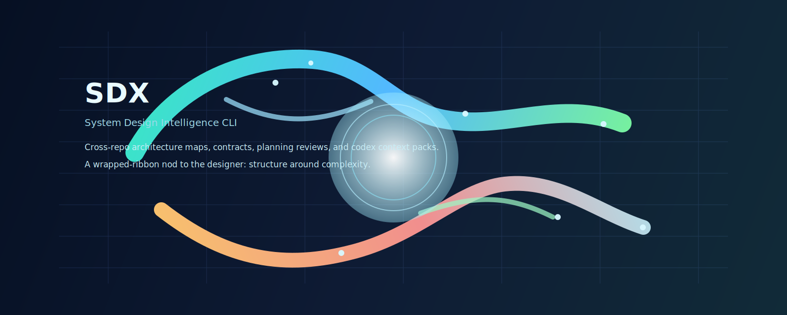
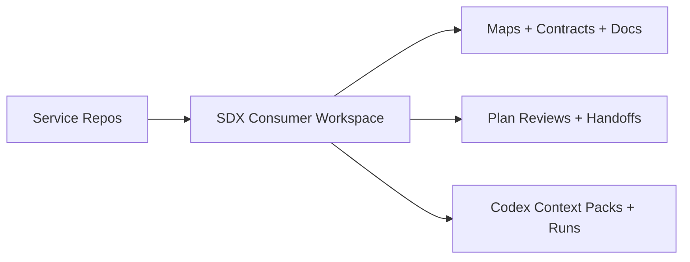

<p align="center">
  
</p>

<h1 align="center">sdx-cli</h1>

<p align="center">
  Docs-first system design intelligence for multi-repo organizations.
</p>

<p align="center">
  <a href="https://github.com/dana0550/system-desiigner/actions/workflows/ci.yml"></a>
  <a href="https://github.com/dana0550/system-desiigner/actions/workflows/release.yml"></a>
  <a href="https://www.npmjs.com/package/sdx-cli"></a>
  <a href="https://www.npmjs.com/package/sdx-cli"></a>
  
  <a href="./LICENSE"></a>
</p>

<p align="center">
  <a href="#why-sdx">Why SDX</a> •
  <a href="#quickstart-consumer-mode">Quickstart</a> •
  <a href="#day-1-workflow">Day 1 Workflow</a> •
  <a href="#command-reference">Commands</a> •
  <a href="#release-model">Release Model</a>
</p>

## Why SDX
`sdx` is a cross-repo CLI that turns scattered service knowledge into a maintained architecture workspace.

It is built for platform teams that need one system-level source of truth while each service stays in its own code repo.

What you get in v1:
- Named service maps with deterministic scope control (`include`, `exclude`, prompt preview/apply).
- Architecture artifacts per map (`service-map.json`, `service-map.md`, `service-map.mmd`, scope logs).
- Contract discovery for OpenAPI, GraphQL, Proto, and AsyncAPI surfaces.
- Plan review artifacts with required NFR checks (latency, availability, durability, SLO, failure handling).
- New-service proposal drafts and per-repo handoff drafts.
- Codex context packs + run transcripts stored for traceability.
- Repo-local state (`.sdx`) and versioned generated outputs.

## Product Model
- `sdx-cli` repo (this repo): source code, tests, release pipeline.
- Consumer workspace: initialized via `npx sdx-cli@<version> bootstrap consumer ...`.
- Recommended topology: one dedicated design repo per org/team.



## Quickstart (Consumer Mode)
Initialize a dedicated system-design workspace in any org/team using a pinned CLI version:

```bash
npx --yes sdx-cli@<version> bootstrap consumer \
  --org <github-org> \
  --design-repo <system-design-repo>
```

This creates:
- `.sdx/config.json`
- `.sdx/install.json`
- `scripts/sdx` (always pinned to the installed version)

Use the wrapper for all commands:

```bash
./scripts/sdx status
```

### Bootstrap Options
```bash
npx --yes sdx-cli@<version> bootstrap consumer \
  --org <github-org> \
  --design-repo <system-design-repo> \
  --mode dedicated \
  --target-dir ./system-design \
  --pin <version> \
  --seed-default-map \
  --create-remote
```

Flag notes:
- `--mode dedicated|in-place` (default: `dedicated`)
- `--create-remote` only works in `dedicated` mode
- `--seed-default-map` requires GitHub auth token (`GITHUB_TOKEN`)

## Day 1 Workflow
After bootstrap, run from the consumer workspace root:

```bash
./scripts/sdx repo sync --org <github-org>
./scripts/sdx repo add --name <repo-name> --path </absolute/local/clone/path>

./scripts/sdx map create platform-core --org <github-org>
./scripts/sdx map include platform-core repo-a repo-b
./scripts/sdx map exclude platform-core legacy-repo
./scripts/sdx map build platform-core

./scripts/sdx contracts extract --map platform-core
./scripts/sdx docs generate --map platform-core
```

Prompt mode (preview first, explicit apply second):

```bash
./scripts/sdx prompt "exclude legacy-repo from map" --map platform-core
./scripts/sdx prompt "exclude legacy-repo from map" --map platform-core --apply
```

## Planning + Handoffs + Codex
Plan review against existing map context:

```bash
./scripts/sdx plan review --map platform-core --plan ./plans/new-service.md
```

Generate new-service architecture options:

```bash
./scripts/sdx service propose --map platform-core --brief ./plans/new-service-brief.md
```

Draft per-repo handoff integration messages:

```bash
./scripts/sdx handoff draft --map platform-core --service payments-orchestrator
```

Run Codex with generated context packs:

```bash
./scripts/sdx codex run implementation-plan --map platform-core --input ./plans/new-service.md
```

## Command Reference
| Area | Commands |
|---|---|
| Bootstrap | `sdx init`, `sdx bootstrap org`, `sdx bootstrap consumer` |
| Repo inventory | `sdx repo sync`, `sdx repo add` |
| Map lifecycle | `sdx map create`, `sdx map include`, `sdx map exclude`, `sdx map remove-override`, `sdx map status`, `sdx map build` |
| Natural-language control | `sdx prompt` |
| Intelligence outputs | `sdx contracts extract`, `sdx docs generate`, `sdx plan review`, `sdx service propose`, `sdx handoff draft`, `sdx publish wiki` |
| Codex | `sdx codex run` |
| Platform | `sdx status`, `sdx version`, `sdx migrate artifacts` |

For full flags/help:

```bash
sdx --help
sdx <topic> --help
sdx <topic> <command> --help
```

## Generated Artifact Layout
```text
.sdx/
  config.json
  install.json
  state.db
maps/<map-id>/
  scope.json
  scope-change-log.md
  service-map.json
  service-map.md
  service-map.mmd
  contracts.json
  contracts.md
docs/architecture/
  <map-id>.md
catalog/dependencies/
  <map-id>.md
plans/reviews/
  <timestamp>-<map-id>.json
  <timestamp>-<map-id>.md
plans/
  <timestamp>-<map-id>-service-proposal.json
  <timestamp>-<map-id>-service-proposal.md
handoffs/
  <timestamp>-<map-id>-<service>.json
  <timestamp>-<map-id>-<service>.md
codex/context-packs/
codex/runs/
```

## Environment
Required for org sync and optional remote repo creation:

```bash
export GITHUB_TOKEN=<token>
```

Optional Codex command override:

```bash
export CODEX_CMD=<codex-binary-name>
```

## Local Development (CLI Source Repo)
```bash
npm ci
npm run typecheck
npm test
npm run build
node ./bin/run.js --help
```

## Release Model
This repo uses **Changesets** with automation on `main`:
- Every user-facing change should include a changeset.
- Merges to `main` trigger release automation.
- The workflow either:
  - opens/updates a Release PR with version/changelog changes, or
  - publishes to npm when release commits are present on `main`.

Maintainer commands:

```bash
npm run changeset
npm run version-packages
npm run release
```

## Non-goals (v1)
- No autonomous cross-repo pull request creation.
- No automated infrastructure mutation or deployments.
- Recommendations are advisory; ownership decisions stay with service teams.

## License
MIT
